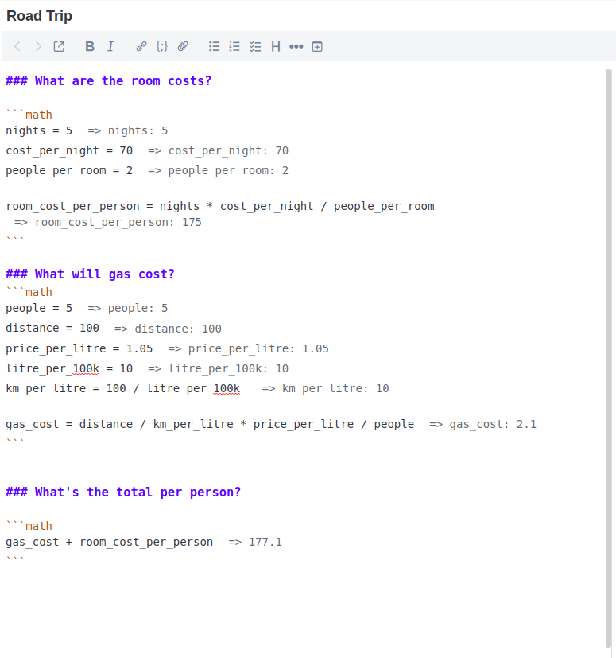

# Math Mode
A plugin for inputting and evaluating math in markdown code blocks. It's built on top of the excellent [mathjs](https://mathjs.org/), meaning it can be used to perform symbolic calculation, vector math and can even handle units!

So what can it do? It's better to demonstrate with an example.




Try some of these!

	= derivative('x^2 + x', 'x')
	
	= 5cm + 0.2 m in inch
	
	= simplify(3 + 2/4)
	
	= i^2
	
	```math
	M = [1, 3; 4, 6]
	
	size(M)
	transpose(M)
	diag(M)
	det(M)
	```
	
	```math
	combinations(6, 3)
	permutations(6, 3)
	```

[Screenshot of the above examples here](./assets/examples.png)

Plus [many more functions](https://mathjs.org/docs/reference/functions.html) provided by mathjs.


# Installation
- Download the release .jpl file from [here](https://github.com/CalebJohn/joplin-math-mode/releases)
- Install the downloaded plugin via `Tools -> Options -> Plugins` in Joplin
- Remember to restart Joplin

# Roadmap
### TODO
- [ ] Add insert button on hover for all math lines (also add one at the top of the block?)
- [ ] Support an "insert all commands in note" from the menu

### Maybe do
- [ ] Support input in latex format (and maybe in $...$)
		- Maybe also support just saving math into a latex format (this is easier with mathjs)
- [ ] Add a markdown-It renderer plugin to get the output on both views
		- Toggle view of equation/results/both
- [ ] Fix math mode greedily highlighting after \`\`\`math (probably need a custom mode)
- [ ] Support BigNums/derivatives and other advanced operations for ergonomically
- [ ] Toggle the display format of results (newline/endline) (include variable name or not)


---


Inspired by [literate-calc-mode](https://github.com/sulami/literate-calc-mode.el) for emacs by [sulami](https://github.com/sulami)
