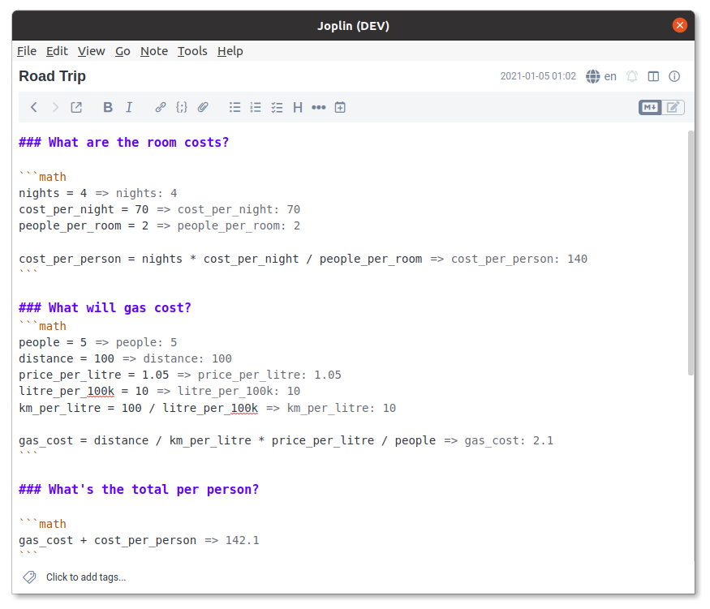

# Math Mode
A plugin for inputting and evaluating math in markdown code blocks. It's built on top of the excellent [mathjs](https://mathjs.org/), meaning it can be used to perform symbolic calculation, vector math and can even handle units!

So what can it do? It's better to demonstrate with an example.




Try some of these!

	= derivative('x^2 + x', 'x')
	
	= 5cm + 0.2 m in inch
	
	= i^2
	
	```math
	M = [1, 3; 4, 6]
	
	size(M)
	transpose(M)
	diag(M)
	det(M)
	```
	
	```math
	combinations(6, 3)
	permutations(6, 3)
	```

View all examples in [the examples folder](./examples). If you have an example of your own, please consider adding it to the examples directory, or sending it my way to have added. Thanks!

Plus [many more functions](https://mathjs.org/docs/reference/functions.html) provided by mathjs.


# Installation
- Go to `Tools -> Options -> Plugins`
- Search for "Math Mode" in the search box
- Click Install and restart Joplin

# Configuration
Math Mode supports a small number of settings that can be adjusted by placing a "config line" inside a math block. The supported settings are (defaults listed first):

	```math
	global: no | yes
	simplify: no | yes
	hide: no | expression | result
	verbose: yes | no
	inline: yes | no
	notation: auto | exponential | engineering
	precision: Any number > 0
	align: left | right
	```

Where
`global` determines if the following settings (within the same block) will apply to all the following blocks.

`simplify` will direct the math engine to simplify rather than solve expressions.

`hide` will hide either a math expression or result.

`verbose` determines if just the result of the expression should be shown, or the variable name as well.

`inline` should the result be placed on the same line as the expression, or below.

`notation` passed to the [mathjs format function](https://mathjs.org/docs/reference/functions/format.html#where), this is the numerical format to use for results.

`precision` the number of decimal places to show, 0 for all.

`align` place the result on the left or right of the editor window.

# Roadmap
### TODO
- [ ] Add a markdown-It renderer plugin to get the output on both views
- [ ] Add syntax or a method for sum calculations
- [ ] Add insert button on context menu for all math lines
	- Done but awaiting plugin system fixes
- [ ] Support an "insert all commands in note" from the menu

### Ideas
There is no plan to implement any of these ideas, but there might be eventually.
- [ ] Support input in latex format (and maybe in $...$)
		- Maybe also support just saving math into a latex format (this is easier with mathjs)
- [ ] Fix math mode greedily highlighting after \`\`\`math (probably need a custom mode)
- [ ] Add global settings to the settings menu


---


Inspired by [literate-calc-mode](https://github.com/sulami/literate-calc-mode.el) for emacs by [sulami](https://github.com/sulami)
