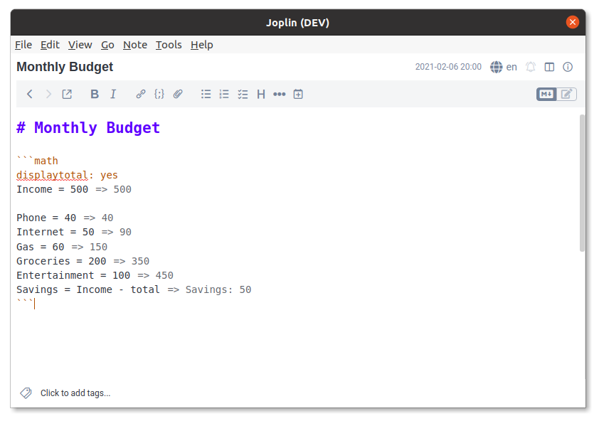

# Basic
## Road Trip
An example of using the calculations while planning. A basic plugin using simple arithmetic across multiple code blocks.

## Monthly Budget
An example showing the usage of the `total` variable. Any continuous block of calculations will be added together into a `total`. This example also demonstrates the `displaytotal` config option.

## What I Owe Mom
Another `total` example that demonstrates the explicit addition and summation syntax for the `total` variable.

# Advanced
## Burger
An example of a recipe with a configurable number of portions, demonstrating unit handling and some settings.

## Compound Interest
An example that uses math to demonstrate the power of compound interest. This example demonstrates some of the more advanced features of mathjs.

